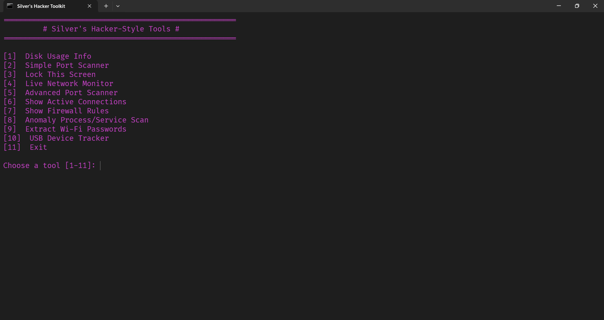

# 🛠️ Silver's Hacker-Style Tools (Batch Script)

> **A powerful Windows batch toolkit for system exploration, diagnostics, and security auditing.**

---

## 🚀 Overview

**Silver's Hacker-Style Tools** is an all-in-one command-line toolkit for power users, sysadmins, penetration testers, and anyone interested in Windows internals. Perform low-level diagnostics, basic forensics, and network monitoring — all from a single batch file with a purple-on-black "hacker-style" menu interface.

---

## 🧰 Features

### 💾 Disk Usage Info
- View space usage (used/free GB) for all drives.

### 🌐 Port Scanner (Basic & Advanced)
- Scan TCP ports on any host.
- **Basic:** Ports 1–100.
- **Advanced:** Wide-range PowerShell-based scan.

### 🔒 Lock Screen
- Instantly lock your Windows session.

### 📡 Live Network Monitor
- Monitor sent/received bytes in real-time per adapter.

### 🔗 Active Network Connections
- Show all open TCP/IP connections with ports and IPs.

### 🛡️ Firewall Rules Dump
- Extract and display all current Windows firewall rules.

### 🕵️ Detect Suspicious Services
- Scan for unsigned or potentially malicious services.

### 📶 Extract Wi-Fi Passwords
- Retrieve saved Wi-Fi network credentials (in plaintext).

### 🚫 USB Disable Tool
- Disable USB storage via registry modification.

### 🌍 Browser Data Dump (Chrome/Edge)
- Copy cookie storage files for basic forensic use.

### 🛑 Detect Keyloggers
- Identify suspicious processes linked to known keylogger behavior.

---

## ⚡ How to Use

1. **Run as Administrator** to enable all functions.
2. Launch the script and enter a number from the menu.
3. Results are displayed in the terminal and logged at:  
   `%temp%\._captainlog.txt`
4. Enjoy the retro console vibe — it's hacker time.

---

## 🖼️ Preview

---

## ⚠️ Important Notes

- 🧪 **Ethical Use Only:** Use only on systems you own or have permission to analyze.
- 🛡️ **Security Policies:** Antivirus or policies may block some functions.
- 🧷 **USB Tool:** Edits registry. Revert changes carefully.
- 🔐 **Browser Files:** Only copies cookie containers — no decryption.
- 🕳️ **Port Scanner:** PowerShell-based (lightweight, no installs, slower than Nmap).

---

## 📜 License

This project is licensed under the [MIT License](LICENSE).  
You're free to use, modify, and distribute — just keep the license notice.

---

## ⭐ Contribute

Pull requests and suggestions are welcome!  
If you find bugs or have feature ideas, open an [issue](https://github.com/Silver595/Windows-Hacker-Tools/issues).

---
